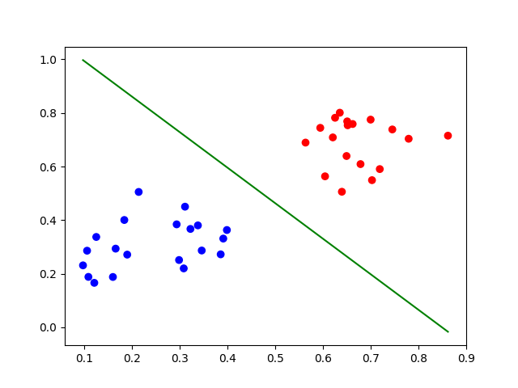

# LogisticRegression
[](https://github.com/MMahdiSetak/LogisticRegression/blob/main/LICENSE)

A simple logistic regression implementation from scratch using NumPy.


## Installation

1. Clone this repository to your machine.
2. Navigate to the project directory and install the required libraries using the `requirements.txt` file:
    ```bash
    pip install -r requirements.txt
    ```

## Usage

1. Run the main script:
    ```bash
    python main.py
    ```

## Results
- **Decision boundary for the sample data**:<br>
  